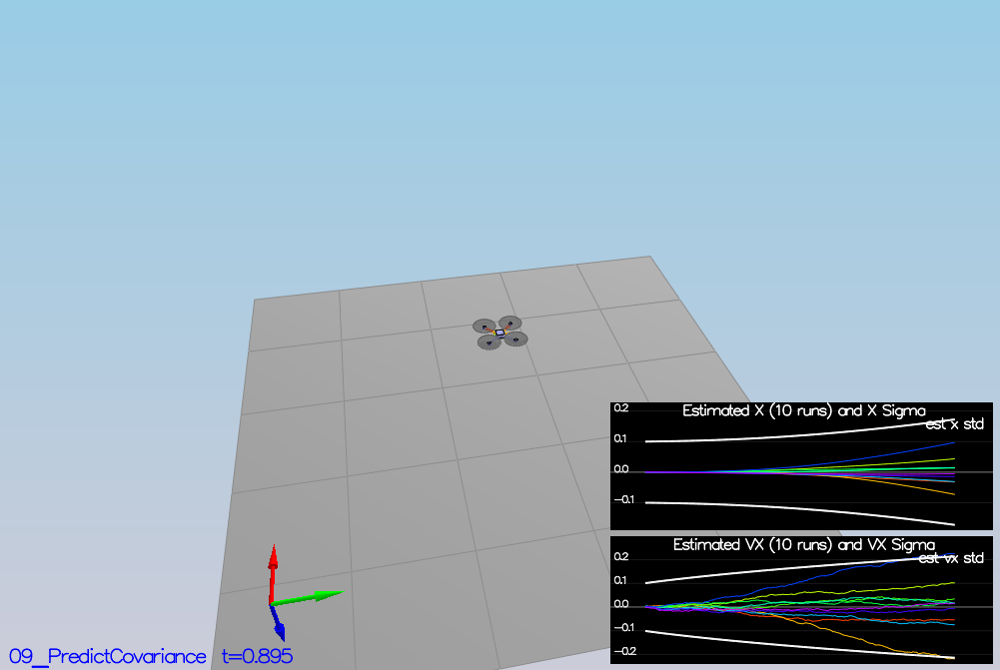

# Quadrotor Estimation Project - Udacity Flying Car Nanodegree

This project is a continuation of the Controls project [controls project](https://github.com/sagarnildass/Udacity-Flying-Car-Nanodegree/tree/master/Projects/3-FCND-Controls). In this project, a 3D estimator is incorporated with Extended Kalman Filters (EKF). The project structure is as follows:

## Project Structure

 - In the QuadEstimatorEKF.cpp file, the EKF is implemented. This file is located in the src directory.
 - In the QuadControl.cpp file, the controllers are implemented. This file is located in the src directory.
 - In the QuadEstimatorEKF.txt, the estimator parameters are defined. This file is located in the config directory.
 - In the QuadControlParams.txt, the controlled parameters are defined. This file is located in the config directory.
 - When you turn on various sensors (the scenarios configure them, e.g. `Quad.Sensors += SimIMU, SimMag, SimGPS`), additional sensor plots will become available to see what the simulated sensors measure.

 - The EKF implementation exposes both the estimated state and a number of additional variables. In particular:

 - `Quad.Est.E.X` is the error in estimated X position from true value.  More generally, the variables in `<vehicle>.Est.E.*` are relative errors, though some are combined errors (e.g. MaxEuler).

 - `Quad.Est.S.X` is the estimated standard deviation of the X state (that is, the square root of the appropriate diagonal variable in the covariance matrix). More generally, the variables in `<vehicle>.Est.S.*` are standard deviations calculated from the estimator state covariance matrix.

 - `Quad.Est.D` contains miscellaneous additional debug variables useful in diagnosing the filter. You may or might not find these useful but they were helpful to us in verifying the filter and may give you some ideas if you hit a block.


#### `config` Directory ####

In the `config` directory, in addition to finding the configuration files for your controller and your estimator, you will also see configuration files for each of the simulations.  For this project, you will be working with simulations 06 through 11 and you may find it insightful to take a look at the configuration for the simulation.

As an example, if we look through the configuration file for scenario 07, we see the following parameters controlling the sensor:

```
# Sensors
Quad.Sensors = SimIMU
# use a perfect IMU
SimIMU.AccelStd = 0,0,0
SimIMU.GyroStd = 0,0,0
```

This configuration tells us that the simulator is only using an IMU and the sensor data will have no noise.  You will notice that for each simulator these parameters will change slightly as additional sensors are being used and the noise behavior of the sensors change.


## The Tasks ##

Once again, you will be building up your estimator in pieces.  At each step, there will be a set of success criteria that will be displayed both in the plots and in the terminal output to help you along the way.

Project outline:

 - [Step 1: Sensor Noise](#step-1-sensor-noise)
 - [Step 2: Attitude Estimation](#step-2-attitude-estimation)
 - [Step 3: Prediction Step](#step-3-prediction-step)
 - [Step 4: Magnetometer Update](#step-4-magnetometer-update)
 - [Step 5: Closed Loop + GPS Update](#step-5-closed-loop--gps-update)
 - [Step 6: Adding Your Controller](#step-6-adding-your-controller)


### Step 1: Sensor Noise ###

For the controls project, the simulator was working with a perfect set of sensors, meaning none of the sensors had any noise.  The first step to adding additional realism to the problem, and developing an estimator, is adding noise to the quad's sensors.  For the first step, you will collect some simulated noisy sensor data and estimate the standard deviation of the quad's sensor.

1. Run the simulator in the same way as you have before

2. Choose scenario `06_NoisySensors`.  In this simulation, the interest is to record some sensor data on a static quad, so you will not see the quad move.  You will see two plots at the bottom, one for GPS X position and one for The accelerometer's x measurement.  The dashed lines are a visualization of a single standard deviation from 0 for each signal. The standard deviations are initially set to arbitrary values (after processing the data in the next step, you will be adjusting these values).  If they were set correctly, we should see ~68% of the measurement points fall into the +/- 1 sigma bound.  When you run this scenario, the graphs you see will be recorded to the following csv files with headers: `config/log/Graph1.txt` (GPS X data) and `config/log/Graph2.txt` (Accelerometer X data).

3. Process the logged files to figure out the standard deviation of the the GPS X signal and the IMU Accelerometer X signal: The standard deviation for the GPS X signal and the IMU Accelerometer X signal are approximately determined to be 0.7 and 0.5.


### Step 2: Attitude Estimation ###

So how do we do full 3D attitude update given gyro measurements? We can actually calculate the time derivative of the euler angles if we know the body rates and the current attitude. And since the body rates are what the gyroscopes measure directly, this is a reasonable approach. The key equation looks like this:


So if we want to get the euler angles at time t, 


This numerical integration technique is called the Euler Forward Method and it is the simplest numerical integration technique that we can do.

The images below shows attitude estimation and how it passes this test.


For this estimation the `UpdateFromIMU()` function was modified. A rotation matrix based on our current Euler angles was created, integrated and converted back to Euler angles.

```c++
void QuadEstimatorEKF::UpdateFromIMU(V3F accel, V3F gyro)
{
  ...
  float theta = pitchEst;
  float phi = rollEst;

  Mat3x3F rot_mat = Mat3x3F::Zeros();
  rot_mat(0,0) = 1;
  rot_mat(0,1) = sin(phi) * tan(theta);
  rot_mat(0,2) = cos(phi) * tan(theta);
  rot_mat(1,1) = cos(phi);
  rot_mat(1,2) = -sin(phi);
  rot_mat(2,1) = sin(phi) / cos(theta);
  rot_mat(2,2) = cos(phi) / cos(theta);

  V3F angle_diff = rot_mat * gyro;

  float predictedPitch = pitchEst + dtIMU * angle_diff.y;
  float predictedRoll = rollEst + dtIMU * angle_diff.x;

  ekfState(6) += dtIMU * angle_diff.z;

  if (ekfState(6) < -F_PI) ekfState(6) += 2.f*F_PI;
  if (ekfState(6) > F_PI) ekfState(6) -= 2.f*F_PI;
  ...
}

```


### Step 3: Prediction Step ###

In this step, the state and covariance prediction steps of the Extended Kalman Filter were implemented. The `PredictState()` method was implemented to transition the state vector.

```c++

VectorXf QuadEstimatorEKF::PredictState(VectorXf curState, float dt, V3F accel, V3F gyro)
{
  ...

  V3F acceleration_matrix = attitude.Rotate_BtoI(accel);
  predictedState[0] = curState[0] + dt * curState[3];
  predictedState[1] = curState[1] + dt * curState[4];
  predictedState[2] = curState[2] + dt * curState[5];
  predictedState[3] = curState[3] + dt * acceleration_matrix[0];
  predictedState[4] = curState[4] + dt * acceleration_matrix[1];
  predictedState[5] = curState[5] + dt * acceleration_matrix[2] - dt * 9.81f;
  
...
}
```

We see the estimator state track the actual state, with only reasonably slow drift, as shown in the figure below:


Next we implement the `GetRbgPrime()` function. In this function, we construct the Jacobian of the body-to-inertial frame rotation matrix.

```c++
MatrixXf QuadEstimatorEKF::GetRbgPrime(float roll, float pitch, float yaw)
{
  ...
  
  RbgPrime(0,0) = -cos(pitch) * sin(yaw);
  RbgPrime(0,1) = -sin(roll) * sin(pitch) * sin(yaw) - cos(roll) * cos(yaw);
  RbgPrime(0, 2) = -cos(roll) * sin(pitch) * sin(yaw) + sin(roll) * cos(yaw);
  RbgPrime(1, 0) = cos(pitch) * cos(yaw);
  RbgPrime(1, 1) = sin(roll) * sin(pitch) * cos(yaw) + cos(roll) * sin(yaw);
  RbgPrime(1, 2) = cos(roll) * sin(pitch) * cos(yaw) + sin(roll) * sin(yaw);


  ...
}
```

Finally we implement the `Predict()` function. This function updates the member variable covariance to the predicted covariance.

```c++

void QuadEstimatorEKF::Predict(float dt, V3F accel, V3F gyro)
{
  ...

  gPrime(0, 3) = dt;
  gPrime(1, 4) = dt;
  gPrime(2, 5) = dt;

  VectorXf accel_matrix(3);
  
  VectorXf RbgAccel(3);
  RbgAccel = RbgPrime * accel_matrix * dt;

  gPrime(3, 6) = RbgAccel(0);
  gPrime(4, 6) = RbgAccel(1);
  gPrime(5, 6) = RbgAccel(2);

  ekfCov = gPrime * ekfCov * gPrime.transpose() + Q;

  ekfState = newState;

}

```

Lastly, we update config/QuadEstimatorEKF.txt provide X/Y position and velocity standard deviations (QPosXYStd and QVelXYStd respectively) in order to capture the error ranges over a small time horizon of one second. The values we get from tuning these 2 parameters are:

  - QPosXYStd: 0.05
  - QVelXYStd: 0.2

Here's how the plot looks after the implementation.





### Step 4: Magnetometer Update ###

Up until now we've only used the accelerometer and gyro for our state estimation. In this step, we added the information from the magnetometer to improve our filter's performance in estimating the vehicle's heading.

The UpdateFromMag() method obtains the yaw prediction from the current EKF state and the measurement from the magnetometer. Then it determines the observation function's Jacobian (with respect to the yaw measurement) and updates the state:

```c++
void QuadEstimatorEKF::UpdateFromMag(float magYaw)
{
  ...
  zFromX(0) = ekfState(6);

  // Update the hprime
  hPrime(6) = 1.0f;

  MatrixXf diff_of_yaw = z - zFromX;

  // normalize the yaw
  if (diff_of_yaw(0) is greater than F-PI) z(0) -= 2.f * F_PI;
  if (diff_of_yaw(0) is less than -F-PI) z(0) += 2.f * F_PI;
  ...
}

```

Lastly the `QYawStd` was obtained by eyeballing the plot in order to ensure capturing of 68% of the sensor noise. The value of `QYawStd` was determined to be 0.08. Now the result looks like this:


### Step 5: Closed Loop + GPS Update ###

GPS measures both position and velocity directly. In the EKF state, we already are estimating all these values. Here, we calculate the partial derivatives of the measurement model `hPrime`

```c++
  hPrime(0, 0) = 1.0;
  hPrime(1, 1) = 1.0;
  hPrime(2, 2) = 1.0;
  hPrime(3, 3) = 1.0;
  hPrime(4, 4) = 1.0;
  hPrime(5, 5) = 1.0;

  zFromX = hPrime * ekfState;
```

After this, we tune the parameters in the `config/QuadEstimatorEKF.txt`. Here are the values:

```
QPosXYStd = .05
QPosZStd = .05
QVelXYStd = .2
QVelZStd = .1
QYawStd = .08

# GPS measurement std deviations
GPSPosXYStd = 1
GPSPosZStd = 300
GPSVelXYStd = .1
GPSVelZStd = .3

# Magnetometer
MagYawStd = .1

dtIMU = 0.002
attitudeTau = 100
```


### Step 6: Adding Your Controller ###


As the final step, the controller from the controls project. We see slight overshoots and that indicates that maybe it would be better to lower the values for `kpPosXY` and `kpVelXY` to get a smoother trajectory. But we see that the simulation passes the tests.


